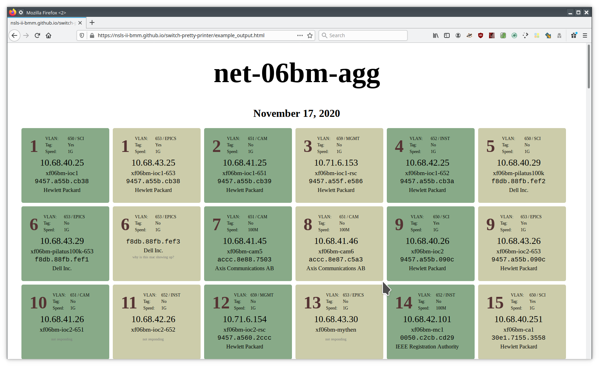

# switch-pretty-printer
Generate a useful HTML page showing how switch ports are configured at
an NSLS-II beamline

```python
from xlsx2html import Ports
m = Ports()
m.spreadsheet = '06BM port info.xlsx'
m.html = 'test.html'
m.read_spreadsheet()  # read data from spreadsheet
m.make_html()         # write data to an html file
```


Here's an example:


